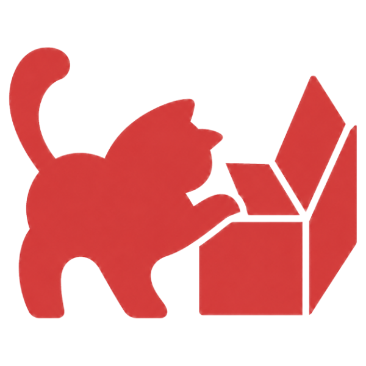

<div align="center">



# Nest Arch — Web

**Your architecture, made explicit.**

The official landing page for [**nest-arch**](https://github.com/Angel-Mario/nest-arch), a powerful CLI and interactive TUI generator for building opinionated, production-ready NestJS applications and microservices.

<br/>

[](https://www.npmjs.com/package/@nest-arch/tui) [](https://github.com/Angel-Mario/nest-arch) [](https://www.typescriptlang.org/) [](https://nextjs.org/) [](https://tailwindcss.com/) [](https://www.convex.dev/) [](LICENSE)

`npx @nest-arch/tui@latest`

</div>

---

## What is nest-arch?

A guided terminal flow for choosing the runtime, data layer, and tooling for your NestJS project **before your first file exists**. Clear decisions in, a production-ready foundation out.

- Guided, intuitive, and beautiful terminal experience with smart prompts
- Handlebars templates with smart resolution and dynamic scaffolding options
- ORMs, auth, Docker, testing, linting, and modern tooling out of the box
- TurboRepo-powered workspaces for scalable architectures and shared packages
- Pluggable engine, custom templates, and limitless architecture possibilities

> **Status:** pre-alpha for NestJS 12.

## What is this repository?

This repository contains the **marketing and promotional website** for the nest-arch product. It does not contain the CLI tool itself — that lives in the [nest-arch](https://github.com/Angel-Mario/nest-arch) repository and is distributed via npm as `@nest-arch/tui`.

The site includes:

- **Hero section** with a live `@nest-arch/tui` version badge (fetched from npm via Convex) and the `npx @nest-arch/tui@latest` install command
- **Interactive terminal wizard** — a fully interactive, in-browser recreation of the real CLI scaffolding flow (keyboard + mouse, all steps, validation and a simulated generate animation)
- **Workflow gallery** — a 5-step screenshot walkthrough (Start → Configure → Confirm → Generate → Done) with an expandable lightbox (zoom, thumbnails, keyboard navigation)
- **Features grid** — the core value propositions of nest-arch
- **Architecture explorer** — an interactive node graph covering Web, Microservices, Monorepos, APIs & Backends, and Databases, with per-category `--type=` usage examples
- **Roadmap page** — a living view of what is planned, waiting, and intentionally unsupported
- **Dark/light theme**, sticky navigation, and responsive layout throughout

## Tech stack

| Layer | Technology |
| --- | --- |
| Framework | [Next.js 16](https://nextjs.org/) (App Router, React Compiler, typed routes) |
| Language | [TypeScript](https://www.typescriptlang.org/) (strict) |
| Styling | [Tailwind CSS v4](https://tailwindcss.com/) + [shadcn/ui](https://ui.shadcn.com/) |
| Backend | [Convex](https://www.convex.dev/) — npm version cron, GitHub/npm OSS stats, webhooks |
| Docs | [Fumadocs](https://fumadocs.vercel.app/) (scaffolded in `apps/fumadocs`) |
| Orchestration | [Turborepo](https://turbo.build/) + [pnpm](https://pnpm.io/) workspaces |
| Quality | [Ultracite](https://github.com/AmanVarshney01/ultracite) (Oxlint + Oxfmt), [Husky](https://typicode.github.io/husky/) |
| Deployment | [Vercel](https://vercel.com/) via `vercel.json` services |

## Getting started

### Prerequisites

- [Node.js](https://nodejs.org/) 20+
- [pnpm](https://pnpm.io/) 9+

### Install

```bash
pnpm install
```

### Configure Convex

The site reads live package versions from Convex, so a backend project is required:

```bash
pnpm run dev:setup
```

Follow the prompts to link/create a Convex project, then copy the environment variables generated in `packages/backend/.env.local` into `apps/*/.env`.

### Run

```bash
pnpm run dev
```

- Web app: http://localhost:3001
- Documentation: http://localhost:4000

To run only the web app:

```bash
pnpm run dev:web
```

## Project structure

```
nest-arch-web/
├── apps/
│   ├── web/                     # Marketing site (Next.js 16, App Router)
│   │   └── src/app/
│   │       ├── _components/     # Page sections (hero, workflow, features, CTA, wizard)
│   │       ├── roadmap/         # Roadmap page
│   │       └── components/      # Header, footer, providers, architecture explorer
│   └── fumadocs/                # Documentation site (Fumadocs, MDX)
├── packages/
│   ├── backend/                 # Convex backend (schema, crons, OSS stats, HTTP actions)
│   ├── ui/                      # Shared shadcn/ui primitives and global styles
│   ├── env/                     # Type-safe environment schema (zod + @t3-oss/env)
│   └── config/                  # Shared TypeScript config
├── scripts/                     # Utility scripts (e.g. sync-vercel-env)
├── turbo.json
├── vercel.json
└── pnpm-workspace.yaml
```

## Available scripts

| Command                | Description                                |
| ---------------------- | ------------------------------------------ |
| `pnpm run dev`         | Start all applications in development mode |
| `pnpm run dev:web`     | Start only the web application (port 3001) |
| `pnpm run dev:setup`   | Configure and link the Convex project      |
| `pnpm run build`       | Build all applications                     |
| `pnpm run check-types` | Type-check all apps and packages           |
| `pnpm run check`       | Run Ultracite linting + formatting checks  |
| `pnpm run fix`         | Auto-fix lint and formatting issues        |
| `pnpm run deploy`      | Create a Vercel preview deployment         |
| `pnpm run deploy:prod` | Deploy to Vercel production                |

## Contributing

The site is built with [Better-T-Stack](https://github.com/AmanVarshney01/create-better-t-stack). Pull requests are welcome — for bugs, typo fixes, or improvements, please open an issue or PR.

## License

[MIT](LICENSE) © 2026 Nest Arch. Built with ❤️ for developers.
