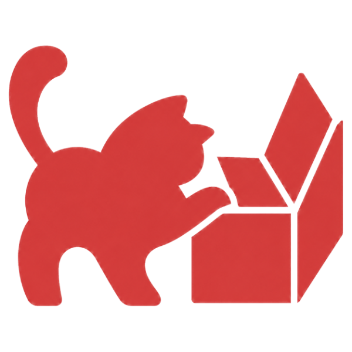

<div align="center">



# Nest Arch — Web

**Your architecture, made explicit.**

The official website for **nest-arch**, a CLI and interactive TUI generator for NestJS applications and microservices. Development remains private. Version 1 supports single applications; monorepo generation is planned for version 2.

<br/>

[](https://www.npmjs.com/package/@nest-arch/tui) [](https://nextjs.org/) [](https://tailwindcss.com/)

`npx @nest-arch/tui@latest`

</div>

---

## What is nest-arch?

A guided terminal flow for choosing the runtime, data layer, and tooling for your NestJS project **before your first file exists**. Clear decisions in, a production-ready foundation out.

- Guided, intuitive, and beautiful terminal experience with smart prompts
- Handlebars templates with smart resolution and dynamic scaffolding options
- ORMs, auth, Docker, testing, linting, and modern tooling out of the box
- Standalone applications and microservices, with PostgreSQL, MySQL, SQLite, MongoDB and SQL Server selections validated against the generator's support policy
- Monorepos and shared packages planned for version 2

> **Status:** pre-alpha for NestJS 12.

## What is this repository?

This repository contains the website, browser wizard, project file explorer and documentation app. The CLI is developed separately in the private `nest-arch` repository and distributed via npm as `@nest-arch/tui`. The website includes a private snapshot of its generation engine and templates for server-side previews.

The site includes:

- **Hero section** with a live `@nest-arch/tui` version badge (fetched from npm via Convex) and the `npx @nest-arch/tui@latest` install command
- **Interactive terminal wizard** — a browser configuration flow for single apps, with keyboard and mouse controls
- **Project file explorer** — real initial files generated from the private CLI snapshot, searchable tree, Material Icon Theme icons, browser-side syntax highlighting, line numbers and file copying
- **Versioned preview cache** — eight static presets, immutable HTTP caching and persistent Blob storage for custom selections; renaming and browsing files stay in the browser
- **Workflow gallery** — a 5-step screenshot walkthrough (Start → Configure → Confirm → Generate → Done) with an expandable lightbox (zoom, thumbnails, keyboard navigation)
- **Features grid** — the core value propositions of nest-arch
- **Architecture explorer** — an interactive overview of application architectures; future categories do not imply current generator support
- **Roadmap page** — release milestones for standalone apps, monorepos, and ongoing project development, with Prisma compatibility notes
- **Dark/light theme**, sticky navigation, and responsive layout throughout

## Tech stack

| Layer | Technology |
| --- | --- |
| Framework | [Next.js 16](https://nextjs.org/) (App Router, React Compiler, typed routes) |
| Language | [TypeScript](https://www.typescriptlang.org/) (strict) |
| Styling | [Tailwind CSS v4](https://tailwindcss.com/) + [shadcn/ui](https://ui.shadcn.com/) |
| Backend | [Convex](https://www.convex.dev/) — npm version cron, GitHub/npm OSS stats, webhooks |
| Docs | [Fumadocs](https://fumadocs.vercel.app/) (scaffolded in `apps/fumadocs`) |
| Orchestration | [Turborepo](https://turbo.build/) + [pnpm](https://pnpm.io/) workspaces |
| Quality | [Ultracite](https://github.com/AmanVarshney01/ultracite) (Oxlint + Oxfmt), [Husky](https://typicode.github.io/husky/) |
| Deployment | [Vercel](https://vercel.com/) via `vercel.json` services |

## Getting started

### Prerequisites

- [Node.js](https://nodejs.org/) 24 (used by the preview synchronization workflow)
- [pnpm](https://pnpm.io/) 11.9.0, as declared in `package.json`

### Install

```bash
pnpm install
```

### Configure Convex

The site reads live package versions from Convex, so a backend project is required:

```bash
pnpm run dev:setup
```

Follow the prompts to link/create a Convex project, then copy the environment variables generated in `packages/backend/.env.local` into `apps/*/.env`.

### Run

```bash
pnpm run dev
```

- Web app: http://localhost:3001
- Documentation: http://localhost:4000

To run only the web app:

```bash
pnpm run dev:web
```

For custom previews on Vercel, connect a public Blob store and configure the server-only `BLOB_READ_WRITE_TOKEN`. Without it, the eight static presets remain available and custom previews return 503. Local development uses a persistent disk cache. See [web setup](apps/web/README.md) and [preview architecture](apps/web/PROJECT-PREVIEW.md).

## Updating nest-arch after an npm release

Follow the [release maintenance guide](docs/NEST-ARCH-RELEASES.md) for the exact manual procedure and one-time automation setup. The workflow in [sync-project-preview.yml](.github/workflows/sync-project-preview.yml) checks npm every six hours, retrieves the matching private source revision, rebuilds the snapshot, runs checks and prepares a synchronization PR.

The npm version badge updates separately through the existing Convex cron. Publishing npm does not automatically update the preview engine until its new snapshot is merged and deployed. Preview regeneration runs in GitHub Actions rather than a Vercel request.

## Project structure

```
nest-arch-web/
├── apps/
│   ├── web/                     # Marketing site (Next.js 16, App Router)
│   │   ├── src/app/[locale]/   # Localized pages, privacy and roadmap
│   │   ├── src/app/api/        # Versioned project preview endpoint
│   │   ├── src/components/    # Providers and project explorer
│   │   ├── private/nest-arch/  # Server-only engine and templates
│   │   ├── public/project-previews/ # Static generated presets
│   │   └── scripts/           # Generator snapshot synchronization
│   └── fumadocs/                # Documentation site (Fumadocs, MDX)
├── packages/
│   ├── backend/                 # Convex backend (schema, crons, OSS stats, HTTP actions)
│   ├── ui/                      # Shared shadcn/ui primitives and global styles
│   ├── env/                     # Type-safe environment schema (zod + @t3-oss/env)
│   └── config/                  # Shared TypeScript config
├── scripts/                     # Utility scripts (e.g. sync-vercel-env)
├── .github/                      # npm release detection and preview sync workflow
├── docs/NEST-ARCH-RELEASES.md      # Maintainer release procedure
├── turbo.json
├── vercel.json
└── pnpm-workspace.yaml
```

## Available scripts

| Command | Description |
| --- | --- |
| `pnpm run dev` | Start all applications in development mode |
| `pnpm run dev:web` | Start only the web application (port 3001) |
| `pnpm run dev:setup` | Configure and link the Convex project |
| `pnpm run build` | Build all applications |
| `pnpm run check-types` | Type-check all apps and packages |
| `pnpm run check` | Run Ultracite linting + formatting checks |
| `pnpm run fix` | Auto-fix lint and formatting issues |
| `pnpm run deploy` | Create a Vercel preview deployment |
| `pnpm run deploy:prod` | Deploy to Vercel production |
| `pnpm --filter web preview:sync` | Sync the snapshot from the sibling generator repository |
| `pnpm --filter web test:preview` | Verify rendering, highlighting and cache behavior |
| `node --test .github/scripts/check-preview-release.test.mjs` | Verify automated release detection |

## Contributing

Development is currently private. Maintainers should validate changes with Ultracite, type checks and the relevant application build. Keep the private generator snapshot, manifest and static previews together when updating a release.

## License

The existing web repository license is recorded in [LICENSE](LICENSE). Development visibility and the generator's source-release plans are separate decisions. Third-party Material Icon Theme assets retain their [MIT notice](apps/web/public/material-icons/LICENSE).
